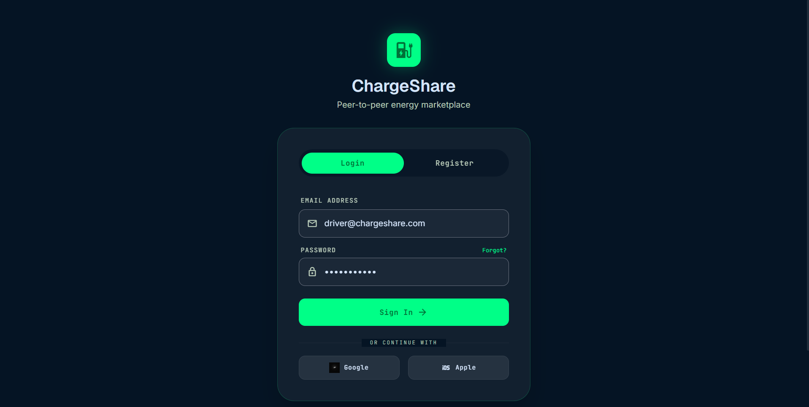
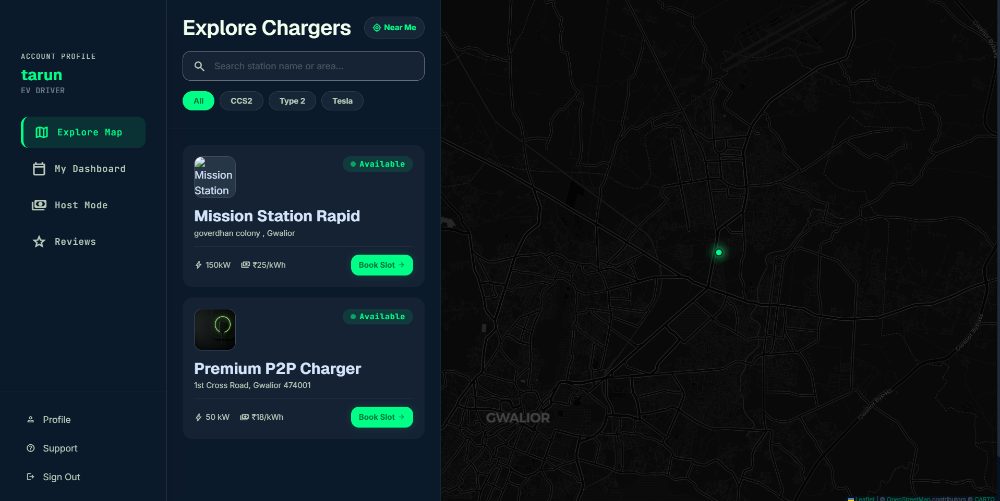
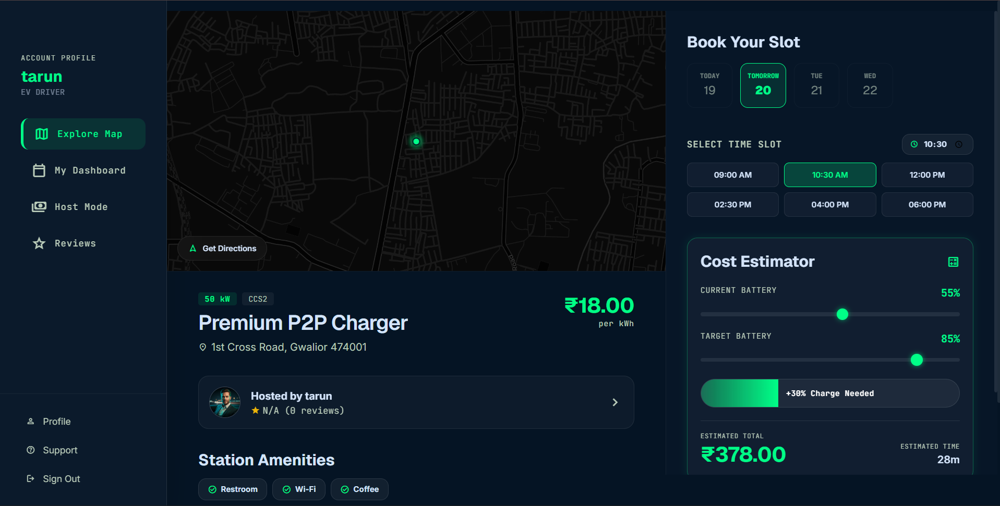
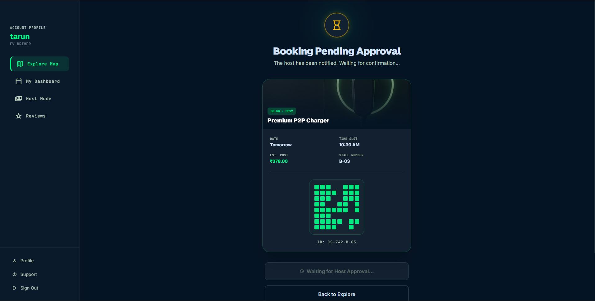
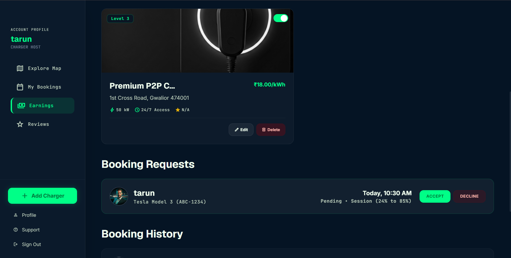
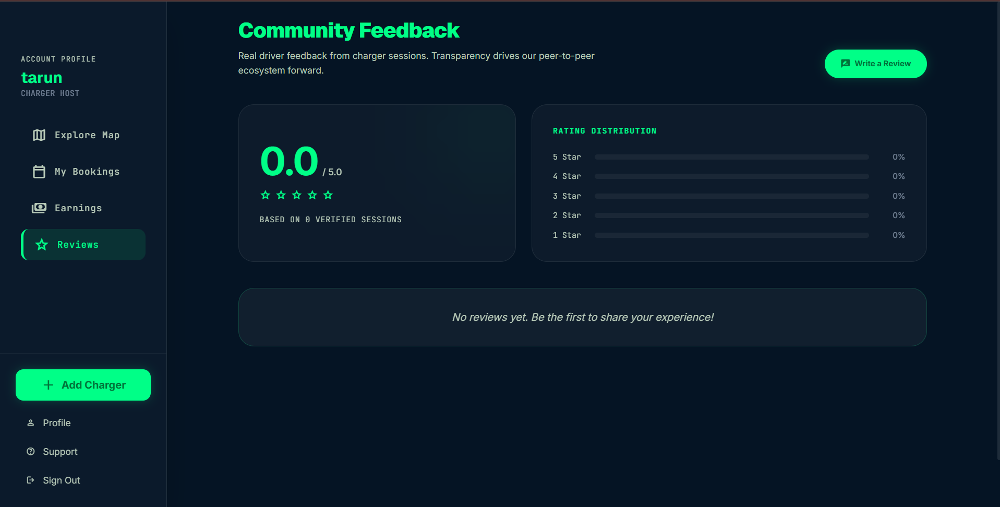
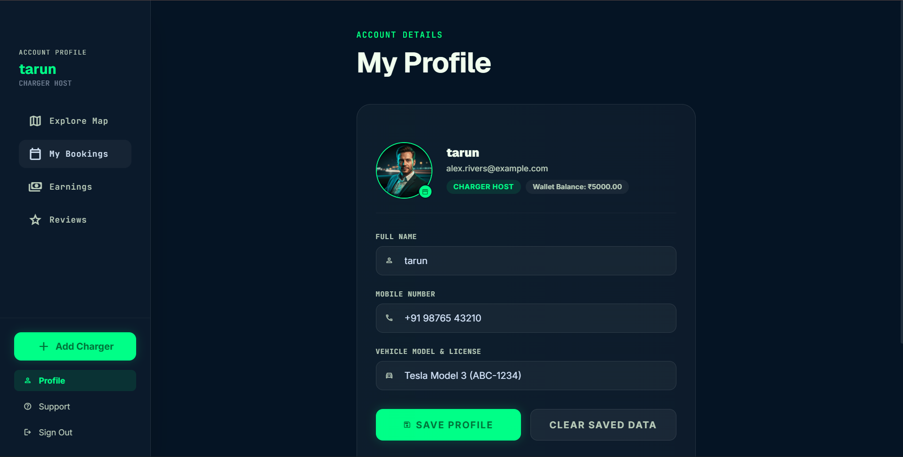
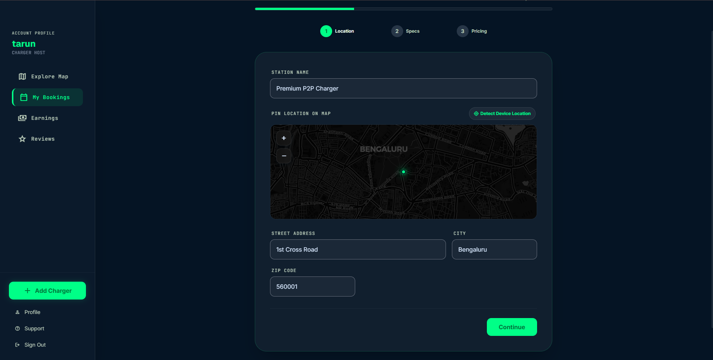
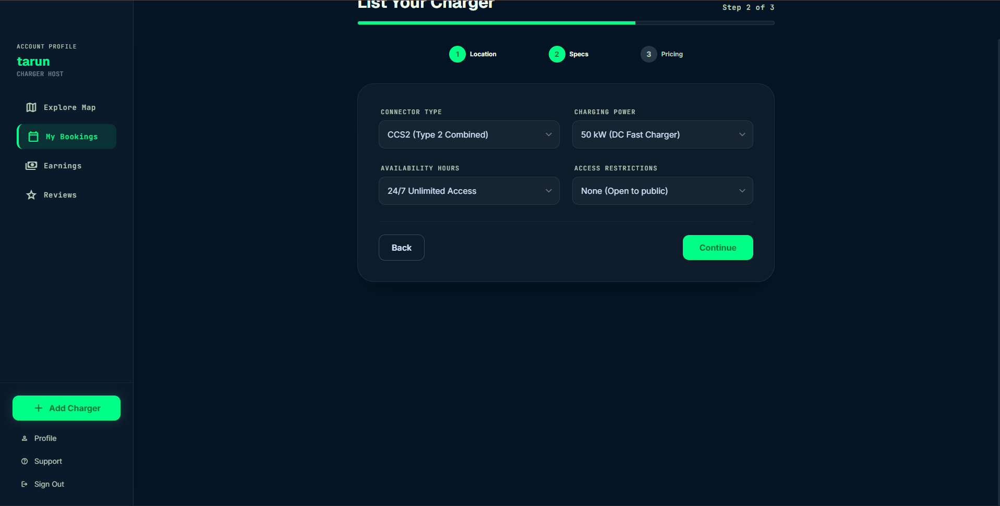
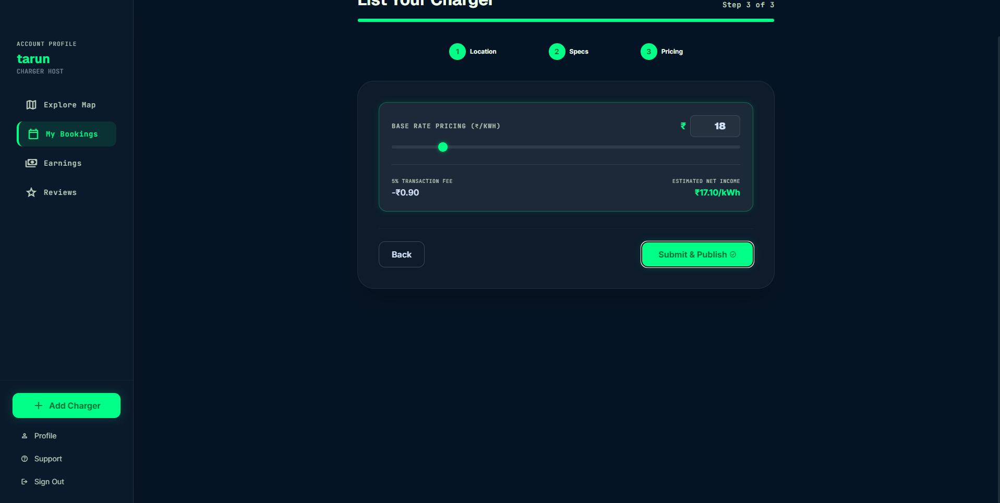

# ⚡ ChargeShare

> A Full-Stack Peer-to-Peer Electric Vehicle Charging Platform built using **React, Spring Boot, and MySQL**.


---

## 📖 About the Project

ChargeShare is a **peer-to-peer EV charging marketplace** that enables electric vehicle owners to discover nearby charging stations, reserve charging slots, estimate charging costs, and monitor charging sessions in real time. The platform also allows private charger owners to publish and manage their charging stations, accept booking requests, track earnings, and receive user reviews.

The application follows a modern **client-server architecture**, with a React frontend communicating with a Spring Boot REST API and MySQL database. Interactive maps are powered by OpenStreetMap and Leaflet, while browser geolocation is used to detect the user's current location.

The project was developed as a full-stack application to demonstrate modern web development practices, RESTful API integration, responsive UI design, and database-driven application development.
---

# ✨ Features

## 👤 Driver Features

- Discover nearby EV charging stations on an interactive map
- Search and filter chargers by connector type, availability, and pricing
- View detailed charger information
- Estimate charging cost and charging duration
- Select preferred charging time slots
- Book charging sessions
- Track booking status in real time
- View charging history
- Monitor active charging sessions
- Submit ratings and reviews after charging

---

## 🏠 Charger Host Features

- Register and publish private charging stations
- Manage charger listings
- Edit charger specifications and pricing
- Accept or decline booking requests
- Monitor ongoing charging sessions
- Track earnings and charging statistics
- View booking history
- Receive ratings and reviews from EV drivers

---

## 📍 Map & Navigation

- Interactive OpenStreetMap integration
- Real-time charger visualization
- Automatic device location detection
- Charger availability indicators
- Location-based charger discovery

---

## ⚡ Charging & Booking

- Dynamic charging cost estimation
- Battery percentage targeting
- Slot-based booking system
- Booking confirmation with QR code
- Charging session monitoring
- Automatic charging cost calculation

---

## ⭐ Reviews & Feedback

- Driver review system
- Star rating system
- Community feedback
- Host rating calculation

---

## 💾 Data Management

- MySQL database integration
- RESTful APIs using Spring Boot
- Local storage fallback
- Persistent user and booking data
- CRUD operations for chargers, bookings, and reviews
---

# 🛠️ Tech Stack

| Category | Technologies |
|----------|--------------|
| **Frontend** | React.js, Vite, Tailwind CSS, Vanilla CSS |
| **Backend** | Spring Boot, Spring Data JPA, Hibernate |
| **Database** | MySQL 8.0 |
| **Build Tools** | Gradle, npm |
| **Maps & Location** | Leaflet.js, OpenStreetMap, Browser Geolocation API |
| **Icons & Fonts** | Material Symbols, Google Fonts |
| **State Management** | React Context API |
| **API Communication** | REST APIs |

---

## 🏗️ System Architecture

```text
                +----------------------+
                |    React Frontend    |
                |      (Vite)          |
                +----------+-----------+
                           |
                    REST API Calls
                           |
                           ▼
                +----------------------+
                |   Spring Boot API    |
                |    (Java Backend)    |
                +----------+-----------+
                           |
                     Spring Data JPA
                           |
                           ▼
                +----------------------+
                |      MySQL 8.0       |
                |      Database        |
                +----------------------+
```

### Architecture Overview

- **Frontend:** React.js application served by Vite.
- **Backend:** Spring Boot REST API handling business logic.
- **Database:** MySQL stores charger, booking, user, and review data.
- **Maps:** Leaflet.js with OpenStreetMap for interactive charger visualization.
- **Communication:** React communicates with Spring Boot using REST APIs, while Spring Data JPA manages persistence in MySQL.
---

# 📸 Application Screenshots

## 🔐 Login Screen



---

## 🏠 Home Dashboard

Explore nearby EV charging stations through an interactive map and charger listings.



---

## 🔋 Charger Details

View charger specifications, charging cost estimation, battery targeting, available time slots, and booking options.



---

## ✅ Booking Confirmation

Review your booking details and receive a confirmation with a unique QR code.



---

## 🏢 Host Dashboard

Manage charger listings, booking requests, earnings, charging sessions, and statistics.



---

## ⭐ Reviews

Drivers can share their charging experience by submitting ratings and reviews.



---

## 👤 User Profile

Manage personal information, wallet balance, vehicle details, and application preferences.



---

## 📍 Add Charger – Location

Select the charger location using the interactive map.



---

## ⚙️ Add Charger – Specifications

Configure charger specifications such as connector type, power output, and availability.



---

## 💰 Add Charger – Pricing

Set pricing details and finalize the charger listing.


---

# 🚀 Getting Started

## Prerequisites

Make sure the following software is installed on your system:

- Node.js (v18 or later)
- Java JDK 21
- MySQL 8.0
- Gradle
- Git

---

## Clone the Repository

```bash
git clone https://github.com/<YOUR_GITHUB_USERNAME>/ChargeShare.git
cd ChargeShare
```

---

## Configure the Database

1. Create a MySQL database named:

```sql
CREATE DATABASE chargeshare;
```

2. Open the backend configuration file and update your database credentials.

```
backend/src/main/resources/application.properties
```

Example:

```properties
spring.datasource.url=jdbc:mysql://localhost:3306/chargeshare
spring.datasource.username=YOUR_USERNAME
spring.datasource.password=YOUR_PASSWORD
```

---

## Run the Backend

```bash
cd backend
./gradlew bootRun
```

For Windows PowerShell:

```powershell
.\gradlew.bat bootRun
```

The backend will start on:

```
http://localhost:8080
```

---

## Run the Frontend

Open a new terminal.

```bash
npm install
npm run dev
```

The frontend will start on:

```
http://localhost:5173
```

---

## Project Structure

```
ChargeShare
│
├── assets/
│   └── screenshots/
│
├── backend/
│
├── src/
│   ├── components/
│   ├── hooks/
│   ├── pages/
│   ├── services/
│   ├── utils/
│   └── App.jsx
│
├── public/
│
├── package.json
├── README.md
└── vite.config.js
```
---

# 🌟 Key Highlights

- 🚗 Peer-to-Peer EV Charging Platform
- ⚡ Full-Stack Application using React, Spring Boot, and MySQL
- 🗺️ Interactive charger discovery with OpenStreetMap & Leaflet
- 📍 Real-time geolocation support
- 🔋 Smart charging cost and duration estimation
- 📅 Dynamic slot-based booking system
- 🏠 Dedicated Host Dashboard for charger owners
- ⭐ Ratings and Reviews system
- 💾 MySQL database with RESTful API architecture
- 📱 Fully responsive and modern user interface

---

# 🔮 Future Enhancements

- 💳 Online payment gateway integration
- 🔔 Push notifications for booking updates
- 📊 Advanced analytics dashboard
- 🤖 AI-powered charger recommendations
- 📍 Route planning with charging stops
- 📱 Progressive Web App (PWA) support
- 🌙 Dark mode
- 📈 Real-time charger availability using WebSockets
- 🔐 User authentication and authorization
- ☁️ Cloud deployment (AWS, Azure, or GCP)

---

# 🤝 Contributing

Contributions, feature suggestions, and bug reports are welcome.

If you'd like to contribute:

1. Fork the repository.
2. Create a new feature branch.
3. Commit your changes.
4. Open a Pull Request.

---

# 👨‍💻 Author

**Tarunendra Singh Parihar**

- 🎓 B.Tech Computer Science & Engineering
- 💻 Full-Stack Java Developer
- 🌱 Passionate about Web Development, Java, Spring Boot, and Problem Solving

---

# 📄 License

This project is developed for educational purposes as part of academic learning and portfolio development.

---

⭐ If you found this project useful, consider giving it a **Star** on GitHub!